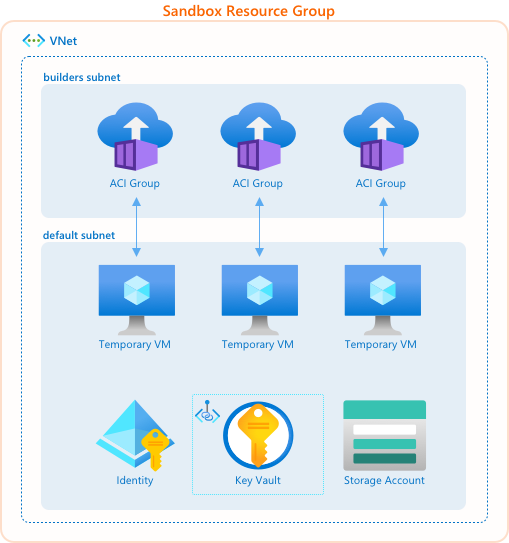

# `az bake`

[](https://github.com/colbylwilliams/az-bake/actions/workflows/release.yml)

Microsoft Azure CLI Extension for creating (or _"baking"_) custom virtual machine (VM) images.

## Install

To install the Azure CLI Custom Image Helper extension, simply run the following command:

```sh
az extension add --source https://github.com/colbylwilliams/az-bake/releases/latest/download/bake-0.3.10-py3-none-any.whl -y
```

### Update

To update Azure CLI DevCenter Helper extension to the latest version:

```sh
az bake upgrade
```

or for the latest pre-release version:

```sh
az bake upgrade --pre
```

## Quickstart

#### 1. [Create][github-repo-create] a new repository, [clone][github-repo-clone] it locally, and open a shell at the root

#### 2. Create a Service Principal (or use an existing one)

_You'll have to [install the Azure CLI][install-az] if you haven't already_

```sh
az ad sp create-for-rbac -n MyUniqueName
```

output:

```json
{
   "appId": "<GUID>",
   "displayName": "MyUniqueName",
   "password": "<STRING>",
   "tenant": "<GUID>"
}
```

#### 3. Create three new [repository secrets][github-repo-secret] with the values output above

- `AZURE_CLIENT_ID` _(appId)_
- `AZURE_CLIENT_SECRET` _(password)_
- `AZURE_TENANT_ID` _(tenant)_

#### 4. [Install](#install) the `az bake` Azure CLI extension

#### 5. Create a new [sandbox](#sandbox), providing an [Azure Compute Gallery][azure-compute-gallery] and the Service Principal's ID (created above)

> _**Important:** The GUID passed in for the `--principal` argument is the principal's Id **NOT** its AppId from the output above. To get the principal's ID, run:_  `az ad sp show --id appId -o tsv --query id`

```sh
az bake sandbox create --name MySandbox --gallery MyGallery --principal 00000000-0000-0000-0000-000000000000
```

#### 6. Setup the repo for use with `az bake`

```sh
az bake repo setup --sandbox MySandbox --gallery MyGallery
```

#### 7. Create an image definiiton in your repo

```sh
az bake image create --name MyImage
```

#### 8. Commit and push your changes

This will kick off a GitHub Actions workflow to build your custom images. Once the workflow is finished, you can continue to monitor the image builds:

```sh
az bake image logs --sandbox MySandbox --name MyImage
```

## Sandbox

In the context of `az bake`, a _sandbox_ is a collection of resources in a resource group that are used to create (or _"bake"_) custom VM images. It's a secure, self-contained environment where [Packer][packer-docs] will be executed from [Azure Container Instance][azure-aci] in a private virtual network. A sandbox is required to use `az bake`. You can be create a new sandbox using the [`az bake sandbox create`](bake/azext_bake/_arm.py#az-bake-sandbox-create) command.

Each sandbox includes a:

- [Key Vault][azure-keyvault]
- [Storage Account][azure-storage-account]
- [Azure Container Instance (ACI) group][azure-aci-groups] for each custom image
- [Virtual Network][azure-vnet], with two subnets
  - A `default` subnet to which the temporary VMs will be joined. This also hosts a private endpoint for the Key Vault.
  - A `builders` subnet to which the ACI containers will be joined. This subnet must be set up to delegate access to ACI, and must only contain ACI container groups.
- [User-assigned Managed Identity][azure-identities] that is assigned to the ACI containers executing Packer and the temporary VMs. This identity will also require the [Contributor][azure-roles-contributor] role on the resource group that contains the [Azure Compute Gallery][azure-compute-gallery] where your custom images will be published.



# Commands

This extension adds the following commands. Use `az bake -h` for more information.

| Command                                                 | Description                                                                      |
| ------------------------------------------------------- | -------------------------------------------------------------------------------- |
| [`az bake sandbox create`](#az-bake-sandbox-create)     | Create a [sandbox](#sandbox).                                                    |
| [`az bake sandbox validate`](#az-bake-sandbox-validate) | Validate a [sandbox](#sandbox).                                                  |
| [`az bake repo build`](#az-bake-repo-build)             | Bake images defined in a repo (usually run in CI).                               |
| [`az bake repo setup`](#az-bake-repo-setup)             | Setup a repo for baking.                                                         |
| [`az bake repo validate`](#az-bake-repo-validate)       | Validate a repo.                                                                 |
| [`az bake image create`](#az-bake-image-create)         | Create an image.                                                                 |
| [`az bake image logs`](#az-bake-image-logs)             | Get the logs for an image build.                                                 |
| [`az bake image rebuild`](#az-bake-image-rebuild)       | Rebuild an image that failed.                                                    |
| [`az bake image bump`](#az-bake-image-bump)             | Bump the version number of images.                                               |
| [`az bake yaml export`](#az-bake-yaml-export)           | Export a bake.yaml file.                                                         |
| [`az bake validate sandbox`](#az-bake-validate-sandbox) | Validate a [sandbox](#sandbox). This is an alias for `az bake sandbox validate`. |
| [`az bake validate repo`](#az-bake-validate-repo)       | Validate a repo. This is an alias for `az bake repo validate`.                   |
| [`az bake version`](#az-bake-version)                   | Show the version of the bake extension.                                          |
| [`az bake upgrade`](#az-bake-upgrade)                   | Update bake cli extension.                                                       |

---

## `az bake sandbox create`

Create a sandbox.

```sh
az bake sandbox create --name
                       [--gallery]
                       [--location]
                       [--principal]
                       [--sandbox]
                       [--tags]
                       [--local]
                       [--pre]
                       [--template-file]
                       [--templates-url]
                       [--version]
                       [--builders-prefix]
                       [--builders-subnet]
                       [--default-prefix]
                       [--default-subnet]
                       [--vnet-address-prefix]
```

### Examples

Create a sandbox.

```sh
az bake sandbox create -l eastus --name mySandbox \
  --gallery myGallery --principal CI_SP_ID
```

Create a sandbox with an existing resource group.

```sh
az bake sandbox create -l eastus -g mySandbox --name my-sandbox \
  --gallery myGallery --principal CI_SP_ID
```

### Required Parameters

#### `--name --name-prefix -n`

The prefix to use in the name of all resources created in the build sandbox. For example if Contoso-Images is provided, the key vault, storage account, and vnet will be named Contoso-Images-kv, contosoimagesstorage, and contoso-images-vent respectively.

### Optional Parameters

#### `--gallery -r`

Name or ID of a Azure Compute Gallery. You can configure the default using `az configure --defaults bake-gallery=<id>`.

#### `--location -l`

Location. Values from: `az account list-locations`. You can configure the default location using `az configure --defaults location=<location>`.

#### `--principal --principal-id`

The principal id of a service principal used to run az bake from a CI pipeline. It will be given contributor role to sandbox resource group.

#### `--sandbox -g -s`

Name of the sandbox resource group. You can configure the default using `az configure --defaults bake-sandbox=<name>`.

#### `--tags`

Space-separated tags: key[=value] [key[=value] ...]. Use '' to clear existing tags.

#### `--local --local-templates`

Use local template file that was packaged with the cli instead of downloading from GitHub.

#### `--pre`

Deploy latest template prerelease version.

#### `--template-file`

Path to custom sandbox arm/bicep template.

#### `--templates-url`

URL to custom templates.json file.

#### `--version -v`

Sandbox template release version.

<sup>default value: latest stable</sup>

#### `--builders-prefix --builders-subnet-prefix`

The CIDR prefix to use when creating the subnet for the ACI containers that execute Packer.

<sup>default value: 10.0.0.128/25</sup>

#### `--builders-subnet --builders-subnet-name`

The name to use when creating the subnet for the ACI containers that execute Packer.

<sup>default value: builders</sup>

#### `--default-prefix --default-subnet-prefix`

The CIDR prefix to use when creating the subnet for the temporary VMs and private endpoints.

<sup>default value: 10.0.0.0/25</sup>

#### `--default-subnet --default-subnet-name`

The name to use when creating the subnet for the temporary VMs and private endpoints.

<sup>default value: default</sup>

#### `--vnet-address-prefix --vnet-prefix`

The CIDR prefix to use when creating a new VNet.

<sup>default value: 10.0.0.0/24</sup>

<details><summary><h4>Global Parameters</h4></summary>

  #### `--debug`

  Increase logging verbosity to show all debug logs.

  #### `--help -h`

  Show this help message and exit.

  #### `--only-show-errors`

  Only show errors, suppressing warnings.

  #### `--output -o`

  Output format.  Allowed values: json, jsonc, none, table, tsv, yaml, yamlc.

  <sup>default value: json</sup>

  #### `--query`

  JMESPath query string. See <http://jmespath.org/> for more information and examples.

  #### `--subscription`

  Name or ID of subscription. You can configure the default subscription using `az account set -s NAME_OR_ID`.

  #### `--verbose`

  Increase logging verbosity. Use --debug for full debug logs.
</details>

## `az bake sandbox validate`

Validate a sandbox.

```sh
az bake sandbox validate --sandbox
                         [--gallery]
```

### Examples

Validate a sandbox.

```sh
az bake sandbox validate --sandbox mySandbox
```

Validate a sandbox and ensure the correct permissions on a gallery.

```sh
az bake sandbox validate --sandbox mySandbox --gallery myGallery
```

### Required Parameters

#### `--sandbox -g -s`

Name of the sandbox resource group. You can configure the default using `az configure --defaults bake-sandbox=<name>`.

### Optional Parameters

#### `--gallery -r`

Name or ID of a Azure Compute Gallery. You can configure the default using `az configure --defaults bake-gallery=<id>`.

<details><summary><h4>Global Parameters</h4></summary>

  #### `--debug`

  Increase logging verbosity to show all debug logs.

  #### `--help -h`

  Show this help message and exit.

  #### `--only-show-errors`

  Only show errors, suppressing warnings.

  #### `--output -o`

  Output format.  Allowed values: json, jsonc, none, table, tsv, yaml, yamlc.

  <sup>default value: json</sup>

  #### `--query`

  JMESPath query string. See <http://jmespath.org/> for more information and examples.

  #### `--subscription`

  Name or ID of subscription. You can configure the default subscription using `az account set -s NAME_OR_ID`.

  #### `--verbose`

  Increase logging verbosity. Use --debug for full debug logs.
</details>

## `az bake repo build`

Bake images defined in a repo (usually run in CI).

```sh
az bake repo build --repo
                   [--images]
                   [--repo-revision]
                   [--repo-token]
                   [--repo-url]
```

### Examples

Build all the images in a repo.

```sh
az bake repo build --repo .
```

### Required Parameters

#### `--repo --repo-path -r`

Path to the locally cloned repository.

### Optional Parameters

#### `--images -i`

Space separated list of images to bake.

<sup>default value: all images in repository<sup>

#### `--repo-revision`

Repository revision.

#### `--repo-token`

Repository token.

#### `--repo-url`

Repository url.

<details><summary><h4>Global Parameters</h4></summary>

  #### `--debug`

  Increase logging verbosity to show all debug logs.

  #### `--help -h`

  Show this help message and exit.

  #### `--only-show-errors`

  Only show errors, suppressing warnings.

  #### `--output -o`

  Output format.  Allowed values: json, jsonc, none, table, tsv, yaml, yamlc.

  <sup>default value: json</sup>

  #### `--query`

  JMESPath query string. See <http://jmespath.org/> for more information and examples.

  #### `--subscription`

  Name or ID of subscription. You can configure the default subscription using `az account set -s NAME_OR_ID`.

  #### `--verbose`

  Increase logging verbosity. Use --debug for full debug logs.
</details>

## `az bake repo setup`

Setup a repo for baking.

```sh
az bake repo setup --gallery
                   [--sandbox]
                   [--repo]
```

### Examples

Setup a repo for baking.

```sh
az bake repo setup --sandbox mySandbox --gallery myGallery
```

### Required Parameters

#### `--gallery -r`

Name or ID of a Azure Compute Gallery. You can configure the default using `az configure --defaults bake-gallery=<id>`.

#### `--sandbox -g -s`

Name of the sandbox resource group. You can configure the default using `az configure --defaults bake-sandbox=<name>`.

### Optional Parameters

#### `--repo --repo-path`

Path to the locally cloned repository.

<sup>default value: ./<sup>

<details><summary><h4>Global Parameters</h4></summary>

  #### `--debug`

  Increase logging verbosity to show all debug logs.

  #### `--help -h`

  Show this help message and exit.

  #### `--only-show-errors`

  Only show errors, suppressing warnings.

  #### `--output -o`

  Output format.  Allowed values: json, jsonc, none, table, tsv, yaml, yamlc.

  <sup>default value: json</sup>

  #### `--query`

  JMESPath query string. See <http://jmespath.org/> for more information and examples.

  #### `--subscription`

  Name or ID of subscription. You can configure the default subscription using `az account set -s NAME_OR_ID`.

  #### `--verbose`

  Increase logging verbosity. Use --debug for full debug logs.
</details>

## `az bake repo validate`

Validate a repo.

```sh
az bake repo validate --repo
```

### Examples

Validate a repo.

```sh
az bake repo validate --repo .
```

### Required Parameters

#### `--repo --repo-path`

Path to the locally cloned repository.

<sup>default value: ./<sup>

<details><summary><h4>Global Parameters</h4></summary>

  #### `--debug`

  Increase logging verbosity to show all debug logs.

  #### `--help -h`

  Show this help message and exit.

  #### `--only-show-errors`

  Only show errors, suppressing warnings.

  #### `--output -o`

  Output format.  Allowed values: json, jsonc, none, table, tsv, yaml, yamlc.

  <sup>default value: json</sup>

  #### `--query`

  JMESPath query string. See <http://jmespath.org/> for more information and examples.

  #### `--subscription`

  Name or ID of subscription. You can configure the default subscription using `az account set -s NAME_OR_ID`.

  #### `--verbose`

  Increase logging verbosity. Use --debug for full debug logs.
</details>

## `az bake image create`

Create an image.

```sh
az bake image create --name
                     [--repo]
```

### Examples

Create an image.yml file.

```sh
az bake image create --name myImage
```

### Required Parameters

#### `--name -n`

Name of the image to create.

### Optional Parameters

#### `--repo --repo-path -r`

Path to the locally cloned repository.

<sup>default value: ./<sup>

<details><summary><h4>Global Parameters</h4></summary>

  #### `--debug`

  Increase logging verbosity to show all debug logs.

  #### `--help -h`

  Show this help message and exit.

  #### `--only-show-errors`

  Only show errors, suppressing warnings.

  #### `--output -o`

  Output format.  Allowed values: json, jsonc, none, table, tsv, yaml, yamlc.

  <sup>default value: json</sup>

  #### `--query`

  JMESPath query string. See <http://jmespath.org/> for more information and examples.

  #### `--subscription`

  Name or ID of subscription. You can configure the default subscription using `az account set -s NAME_OR_ID`.

  #### `--verbose`

  Increase logging verbosity. Use --debug for full debug logs.
</details>

## `az bake image logs`

Get the logs for an image build.

```sh
az bake image logs --name
                   --sandbox
```

### Examples

Get the logs for an image.

```sh
az bake image logs --sandbox mySandbox --name myImage
```

### Required Parameters

#### `--name -n`

Name of the image.

#### `--sandbox -g -s`

Name of the sandbox resource group. You can configure the default using `az configure --defaults bake-sandbox=<name>`.

<details><summary><h4>Global Parameters</h4></summary>

  #### `--debug`

  Increase logging verbosity to show all debug logs.

  #### `--help -h`

  Show this help message and exit.

  #### `--only-show-errors`

  Only show errors, suppressing warnings.

  #### `--output -o`

  Output format.  Allowed values: json, jsonc, none, table, tsv, yaml, yamlc.

  <sup>default value: json</sup>

  #### `--query`

  JMESPath query string. See <http://jmespath.org/> for more information and examples.

  #### `--subscription`

  Name or ID of subscription. You can configure the default subscription using `az account set -s NAME_OR_ID`.

  #### `--verbose`

  Increase logging verbosity. Use --debug for full debug logs.
</details>

## `az bake image rebuild`

Rebuild an image that failed.

```sh
az bake image rebuild --name
                      --sandbox
                      [--no-wait]
```

### Examples

Rebuild an image that failed.

```sh
az bake image rebuild --sandbox mySandbox --name myImage
```

### Required Parameters

#### `--name -n`

Name of the image to rebuild.

#### `--sandbox -g -s`

Name of the sandbox resource group. You can configure the default using `az configure --defaults bake-sandbox=<name>`.

### Optional Parameters

#### `--no-wait`

Do not wait for the long-running operation to finish.

<details><summary><h4>Global Parameters</h4></summary>

  #### `--debug`

  Increase logging verbosity to show all debug logs.

  #### `--help -h`

  Show this help message and exit.

  #### `--only-show-errors`

  Only show errors, suppressing warnings.

  #### `--output -o`

  Output format.  Allowed values: json, jsonc, none, table, tsv, yaml, yamlc.

  <sup>default value: json</sup>

  #### `--query`

  JMESPath query string. See <http://jmespath.org/> for more information and examples.

  #### `--subscription`

  Name or ID of subscription. You can configure the default subscription using `az account set -s NAME_OR_ID`.

  #### `--verbose`

  Increase logging verbosity. Use --debug for full debug logs.
</details>

## `az bake image bump`

Bump the version numbers of images.

```sh
az bake image bump [--images]
                   [--repo]
                   [--major]
                   [--minor]

```

### Examples

Bump the patch version of all images.

```sh
az bake image bump
```

Bump the minor version of all images.

```sh
az bake image bump --minor
```

Bump the major version of specific images.

```sh
az bake image bump --major --images myImage1 MyImage2
```

### Optional Parameters

#### `--images -i`

Space separated list of images to bump.

<sup>default value: all images in repository<sup>

#### `--repo --repo-path`

Path to the locally cloned repository.

#### `--major`

Bump the major version.

#### `--minor`

Bump the minor version

<sup>default value: ./<sup>

<details><summary><h4>Global Parameters</h4></summary>

  #### `--debug`

  Increase logging verbosity to show all debug logs.

  #### `--help -h`

  Show this help message and exit.

  #### `--only-show-errors`

  Only show errors, suppressing warnings.

  #### `--output -o`

  Output format.  Allowed values: json, jsonc, none, table, tsv, yaml, yamlc.

  <sup>default value: json</sup>

  #### `--query`

  JMESPath query string. See <http://jmespath.org/> for more information and examples.

  #### `--subscription`

  Name or ID of subscription. You can configure the default subscription using `az account set -s NAME_OR_ID`.

  #### `--verbose`

  Increase logging verbosity. Use --debug for full debug logs.
</details>

## `az bake yaml export`

Export a bake.yaml file.

```sh
az bake yaml export --gallery
                    --sandbox
                    [--outdir]
                    [--outfile]
                    [--stdout]
```

### Examples

Export a bake.yaml file to a directory.

```sh
az bake yaml export --sandbox mySandbox --gallery myGallery --outdir ./myDir
```

Export a bake.yaml file to a specific file.

```sh
az bake yaml export --sandbox mySandbox --gallery myGallery --outfile ./myDir/myFile.yaml
```

Print the bake.yaml file output to the console.

```sh
az bake yaml export --sandbox mySandbox --gallery myGallery --stdout
```

### Required Parameters

#### `--gallery -r`

Name or ID of a Azure Compute Gallery. You can configure the default using `az configure --defaults bake-gallery=<id>`.

#### `--sandbox -g -s`

Name of the sandbox resource group. You can configure the default using `az configure --defaults bake-sandbox=<name>`.

### Optional Parameters

#### `--outdir`

When set, saves the output at the specified directory.

#### `--outfile`

When set, saves the output as the specified file path.

<sup>default value: ./bake.yml<sup>

#### `--stdout`

When set, prints all output to stdout instead of corresponding files.

<details><summary><h4>Global Parameters</h4></summary>

  #### `--debug`

  Increase logging verbosity to show all debug logs.

  #### `--help -h`

  Show this help message and exit.

  #### `--only-show-errors`

  Only show errors, suppressing warnings.

  #### `--output -o`

  Output format.  Allowed values: json, jsonc, none, table, tsv, yaml, yamlc.

  <sup>default value: json</sup>

  #### `--query`

  JMESPath query string. See <http://jmespath.org/> for more information and examples.

  #### `--subscription`

  Name or ID of subscription. You can configure the default subscription using `az account set -s NAME_OR_ID`.

  #### `--verbose`

  Increase logging verbosity. Use --debug for full debug logs.
</details>

## `az bake validate sandbox`

Validate a sandbox. This is an alias for [`az bake sandbox validate`](#az-bake-sandbox-validate).

```sh
az bake validate sandbox --sandbox
                         [--gallery]
```

### Examples

Validate a sandbox.

```sh
az bake validate sandbox --sandbox mySandbox --gallery /My/Gallery/Resource/ID
```

### Required Parameters

#### `--sandbox -g -s`

Name of the sandbox resource group. You can configure the default using `az configure --defaults bake-sandbox=<name>`.

### Optional Parameters

#### `--gallery -r`

Name or ID of a Azure Compute Gallery. You can configure the default using `az configure --defaults bake-gallery=<id>`.

<details><summary><h4>Global Parameters</h4></summary>

  #### `--debug`

  Increase logging verbosity to show all debug logs.

  #### `--help -h`

  Show this help message and exit.

  #### `--only-show-errors`

  Only show errors, suppressing warnings.

  #### `--output -o`

  Output format.  Allowed values: json, jsonc, none, table, tsv, yaml, yamlc.

  <sup>default value: json</sup>

  #### `--query`

  JMESPath query string. See <http://jmespath.org/> for more information and examples.

  #### `--subscription`

  Name or ID of subscription. You can configure the default subscription using `az account set -s NAME_OR_ID`.

  #### `--verbose`

  Increase logging verbosity. Use --debug for full debug logs.
</details>

## `az bake validate repo`

Validate a repo. This is an alias for [`az bake repo validate`](#az-bake-repo-validate).

```sh
az bake validate repo --repo
```

### Examples

Validate a repo.

```sh
az bake validate repo --repo .
```

### Required Parameters

#### `--repo --repo-path`

Path to the locally cloned repository.

<sup>default value: ./<sup>

<details><summary><h4>Global Parameters</h4></summary>

  #### `--debug`

  Increase logging verbosity to show all debug logs.

  #### `--help -h`

  Show this help message and exit.

  #### `--only-show-errors`

  Only show errors, suppressing warnings.

  #### `--output -o`

  Output format.  Allowed values: json, jsonc, none, table, tsv, yaml, yamlc.

  <sup>default value: json</sup>

  #### `--query`

  JMESPath query string. See <http://jmespath.org/> for more information and examples.

  #### `--subscription`

  Name or ID of subscription. You can configure the default subscription using `az account set -s NAME_OR_ID`.

  #### `--verbose`

  Increase logging verbosity. Use --debug for full debug logs.
</details>

## `az bake version`

Show the version of the bake extension.

```sh
az bake version
```

<details><summary><h4>Global Parameters</h4></summary>

  #### `--debug`

  Increase logging verbosity to show all debug logs.

  #### `--help -h`

  Show this help message and exit.

  #### `--only-show-errors`

  Only show errors, suppressing warnings.

  #### `--output -o`

  Output format.  Allowed values: json, jsonc, none, table, tsv, yaml, yamlc.

  <sup>default value: json</sup>

  #### `--query`

  JMESPath query string. See <http://jmespath.org/> for more information and examples.

  #### `--subscription`

  Name or ID of subscription. You can configure the default subscription using `az account set -s NAME_OR_ID`.

  #### `--verbose`

  Increase logging verbosity. Use --debug for full debug logs.
</details>

## `az bake upgrade`

Update bake cli extension.

```sh
az bake upgrade [-pre]
                [--version]
```

### Examples

Update bake cli extension to the latest stable release.

```sh
az bake upgrade
```

Update bake cli extension to the latest pre-release.

```sh
az bake upgrade --pre
```

Update bake cli extension a specific version.

```sh
az bake upgrade --version 0.1.0
```

### Optional Parameters

#### `--pre`

Update to the latest template prerelease version.

#### `--version -v`

Version (tag). Default: latest stable.

<details><summary><h4>Global Parameters</h4></summary>

  #### `--debug`

  Increase logging verbosity to show all debug logs.

  #### `--help -h`

  Show this help message and exit.

  #### `--only-show-errors`

  Only show errors, suppressing warnings.

  #### `--output -o`

  Output format.  Allowed values: json, jsonc, none, table, tsv, yaml, yamlc.

  <sup>default value: json</sup>

  #### `--query`

  JMESPath query string. See <http://jmespath.org/> for more information and examples.

  #### `--subscription`

  Name or ID of subscription. You can configure the default subscription using `az account set -s NAME_OR_ID`.

  #### `--verbose`

  Increase logging verbosity. Use --debug for full debug logs.
</details>

[install-az]:https://learn.microsoft.com/en-us/cli/azure/install-azure-cli
[azure-identities]:https://learn.microsoft.com/en-us/azure/active-directory/managed-identities-azure-resources/overview
[azure-compute-gallery]:https://learn.microsoft.com/en-us/azure/virtual-machines/azure-compute-gallery
[azure-keyvault]:https://learn.microsoft.com/en-us/azure/key-vault/general/overview
[azure-storage-account]:https://learn.microsoft.com/en-us/azure/storage/common/storage-account-overview
[azure-aci]:https://learn.microsoft.com/en-us/azure/container-instances/container-instances-overview
[azure-aci-groups]:https://learn.microsoft.com/en-us/azure/container-instances/container-instances-container-groups
[azure-vnet]:https://learn.microsoft.com/en-us/azure/virtual-network/virtual-networks-overview
[azure-roles-contributor]:https://docs.microsoft.com/en-us/azure/role-based-access-control/built-in-roles#contributor
[azure-assign-rbac]:https://docs.microsoft.com/en-us/azure/role-based-access-control/role-assignments-portal?tabs=current
[github-repo-create]:https://docs.github.com/en/get-started/quickstart/create-a-repo
[github-repo-clone]:https://docs.github.com/en/repositories/creating-and-managing-repositories/cloning-a-repository
[github-repo-secret]:https://docs.github.com/en/actions/reference/encrypted-secrets#creating-encrypted-secrets-for-a-repository
[github-repo-fork]:https://docs.github.com/en/get-started/quickstart/fork-a-repo
[packer-arm]:https://www.packer.io/plugins/builders/azure/arm
[packer-docs]:https://developer.hashicorp.com/packer/docs